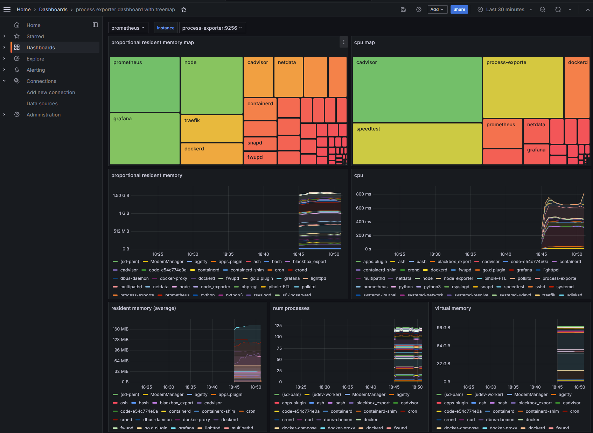
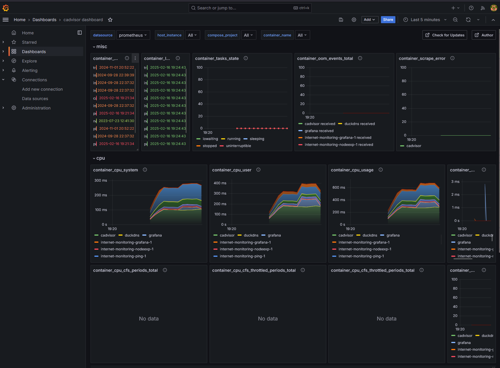

# Container and Process Monitoring

This project sets up a monitoring stack using Docker Compose, including Grafana, Prometheus, and a process exporter.

## Project Structure
```
docker-compose.yml
grafana/
    config.monitoring
    provisioning/
        dashboards/
            cadvisor.json
            dashboard.yml
            process-exporter-with-treemap.json
        datasources/
            datasource.yml
process-exporter/
    config.yml
prometheus/
    prometheus.yml
README.md
```

## Services

### Grafana

Grafana is used for visualizing the metrics collected by Prometheus.

- **Container Name:** `grafana`
- **Image:** `grafana/grafana`
- **Ports:** `3000:3000`
- **Configuration:** 
  - Environment variables are set in [`config.monitoring`](./grafana/config.monitoring).
  - Provisioning files are located in [`provisioning`](./grafana/provisioning).

### Prometheus

Prometheus is used for scraping and storing metrics.

- **Configuration:** [`prometheus.yml`](./prometheus/prometheus.yml)

### Process Exporter

The process exporter collects metrics about system processes.

- **Configuration:** [`config.yml`](./process-exporter/config.yml)

## Setup

1. **Clone the repository:**
   ```sh
   git clone https://github.com/cristhian-caballero/container-and-process-metrics.git
   cd container-and-process-metrics

1. **Start the services:**
   ```sh
   docker compose up -d

1. **Access Grafana:** Open your browser and go to http://localhost:3000. The default login credentials are located in [`config.monitoring`](./grafana/config.monitoring)

## Configuration
### Grafana
- **Dashboards:** Provisioned dashboards are located in dashboards.
    - Example: [process-exporter-with-treemap.json](./grafana/provisioning/dashboards/process-exporter-with-treemap.json) provides a dashboard for the process exporter.
- **Datasources:** Datasource configurations are located in [datasource.yml](./grafana/provisioning/datasources/datasource.yml).
### Prometheus
- **Configuration:** The Prometheus configuration file is located at [`prometheus.yml`](./prometheus/prometheus.yml).
### Process Exporter
- **Configuration:** The process exporter configuration file is located at [`config.yml`](./process-exporter/config.yml).
### Volumes
- **Grafana Data:** A Docker volume named grafana_data is used to persist Grafana data.
### Environment Variables
- **Grafana:** Environment variables for Grafana are set in [`config.monitoring`](./grafana/config.monitoring).
## Notes
- Ensure that Docker and Docker Compose are installed on your system.
- The Grafana container depends on the Prometheus container, so Prometheus must be running for Grafana to start correctly.
## Example Dashboards
### Process exporter

### cAdvisor
